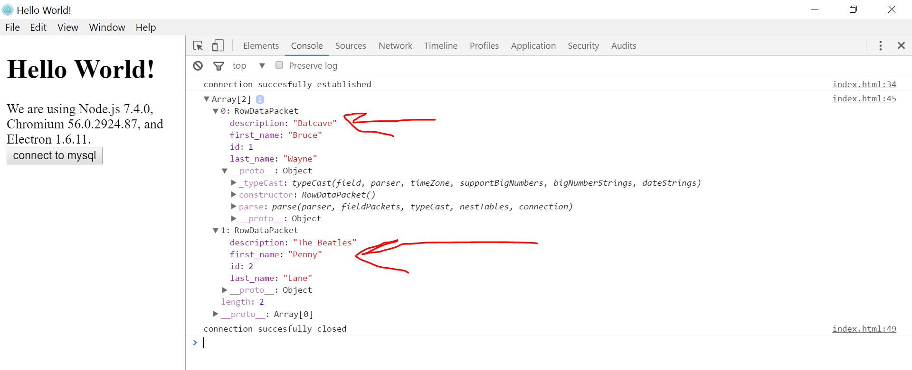

# electron and mysql

**Clone and run for a quick way to see Electron in action.**



Put your MySQL credentials in the 'index.html' file along with test queries.

You can <a href="https://www.youtube.com/watch?v=oCKDF9BU6cI&t=98s">find the Tutorial here</a>

## To Use

To clone and run this repository you'll need [Git](https://git-scm.com) and [Node.js](https://nodejs.org/en/download/) (which comes with [npm](http://npmjs.com)) installed on your computer. From your command line:

```bash
# Clone this repository
git clone https://github.com/electron/electron-quick-start
# Go into the repository
cd electron-quick-start
# Install dependencies
npm install
# Run the app
npm start
```
